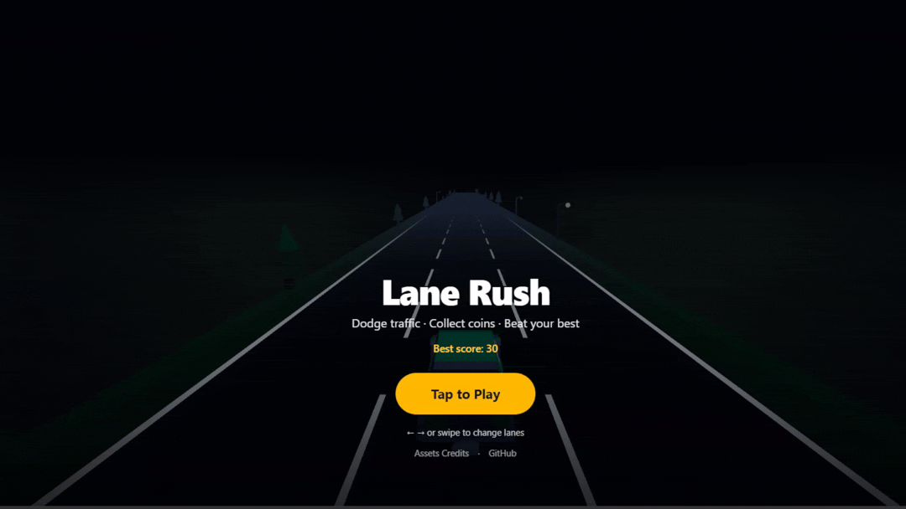

# Lane Rush

**[Play the game →](https://late-night-lane-rush.vercel.app/)**



3-lane endless car dodge game built with **Next.js**, **TypeScript**, and **React Three Fiber**.

Dodge traffic, collect coins, and beat your best score. No backend - best score saved in `localStorage`.

## Quick start

```bash
npm install
npm run dev
```

Open [http://localhost:3000](http://localhost:3000), or play the deployed version at [late-night-lane-rush.vercel.app](https://late-night-lane-rush.vercel.app/).

## Controls

| Platform | Input |
|----------|-------|
| Desktop | ← → arrow keys (A/D also work) |
| Mobile | Swipe left / right (portrait) |

## Project structure

```
app/              Next.js pages
components/       R3F scene, UI, game logic
hooks/            keyboard, swipe, game state
lib/              constants, collision, storage, audio, speed
public/models/    GLB assets used in-game
public/audio/     BGM and SFX (OGG)
```

## Assets

In-game models live in `public/models/` (Kenney CC0, copied from Car Kit):

| Path | Used for |
|------|----------|
| `player/hatchback-sports.glb` | Player car |
| `obstacles/delivery.glb` | Obstacle |
| `obstacles/taxi.glb` | Obstacle |
| `obstacles/truck.glb` | Obstacle |
| `obstacles/cone.glb` | Obstacle |

Road and grass are procedural geometry (`Highway.tsx`), not GLB models.

Audio files in `public/audio/`:

| Path | Used for |
|------|----------|
| `bgm.ogg` | Background music loop |
| `coin.ogg` | Coin pickup |
| `crash.ogg` | Game over / collision |

Sound credits: Kenney (Casino Audio, Impact Sounds) and MintoDog (Cool Highway) - see `lib/assetCredits.ts`.

## Performance

The game stays smooth on mid-range phones and laptops because it avoids heavy runtime work:

- **Object pooling** - obstacles, coins, and roadside scenery are reused from fixed pools instead of spawning/destroying meshes every frame.
- **Recycled road** - a small set of road segments scrolls and loops; the fog hides the recycle seam.
- **Lightweight world** - road, grass, coins, and scenery are procedural geometry; only 5 small GLB models are loaded (player + 4 obstacles), preloaded at startup.
- **Simple collision** - lane + depth checks only; no physics engine.
- **Small asset footprint** - about 0.8 MB of models and 3 audio files, so load time stays low.

## v1 scope

- [x] 3 lanes, speed ramp over time
- [x] Obstacle & coin pooling
- [x] Lane + Z collision
- [x] Score + localStorage best
- [x] Start / HUD / game over UI
- [x] BGM + coin/crash SFX
- [ ] Power-ups (v2)
